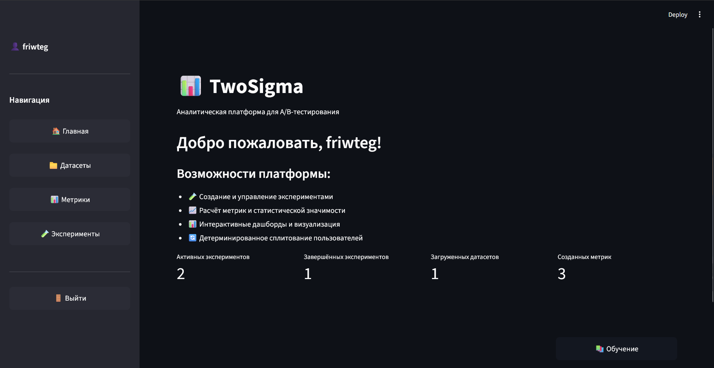

# TwoSigma — Платформа для A/B тестирования

Веб-платформа для проведения A/B тестов с визуальным конструктором метрик и статистическим анализом. 
Позволяет загружать данные, создавать метрики (12 готовых шаблонов + SQL), запускать эксперименты и анализировать результаты с автоматическим расчетом статистической значимости.


## 📖 Быстрый старт

### 1. Регистрация
- Откройте приложение
- Перейдите на вкладку "Регистрация"
- Заполните форму и создайте аккаунт

### 2. Загрузка датасета
- Войдите в систему
- Перейдите в раздел **"📁 Датасеты"**
- Загрузите CSV файл с данными
- Требования к датасету:
  - Формат: CSV (разделитель - запятая)
  - Обязательные колонки: `user_id`, `date`
  - Колонки с метриками (например: `revenue`, `status`)

### 3. Создание метрики
- Перейдите в раздел **"📊 Метрики"**
- Нажмите "Добавить новую метрику"
- Выберите **"Визуальный конструктор"**
- Выберите тип метрики (например, Conversion Rate)
- Настройте поля и сохраните

### 4. Создание эксперимента
- Перейдите в раздел **"🧪 Эксперименты"**
- Нажмите "Создать эксперимент"
- Заполните параметры:
  - Название
  - Датасет
  - Метрика
  - Период эксперимента
  - Соотношение групп (например, 50/50)
- Создайте эксперимент

### 5. Расчет результатов
- Дождитесь окончания эксперимента
- Обновите датасет с новыми данными (если нужно)
- Нажмите "Рассчитать результаты"
- Изучите графики и статистическую значимость


## 📁 Структура проекта

```
TwoSigma/
├── app.py                      # Главное приложение
├── config.py                   # Конфигурация
├── database.py                 # Работа с БД
├── models.py                   # SQLAlchemy модели
├── requirements.txt            # Зависимости
│
├── components/                 # UI компоненты
│   ├── experiment_calculator.py
│   ├── experiment_creator.py
│   ├── experiment_display.py
│   ├── metric_calculator.py
│   └── metric_creator.py
│
├── pages/                      # Страницы приложения
│   ├── datasets.py
│   ├── experiments.py
│   ├── login.py
│   ├── metrics.py
│   └── tutorial.py
│
├── utils/                      # Вспомогательные функции
│   ├── ab_test_helper.py      # Статистические тесты
│   ├── chart_helper.py        # Графики
│   ├── experiment_dataset_helper.py
│   ├── metric_display.py
│   ├── metric_templates.py
│   ├── period_helper.py
│   └── session_manager.py
│
├── data/
│   └── experiments/           # Датасеты экспериментов
│
└── uploaded_datasets/         # Загруженные датасеты
```


## 📊 Поддерживаемые метрики

### Метрики выручки
- **Revenue** — общая выручка
- **AOV** — средний чек
- **ARPU** — средний доход на пользователя
- **LTV** — пожизненная ценность клиента
- **GMV** — валовая стоимость товаров
- **CAC** — стоимость привлечения клиента

### Метрики вовлеченности
- **DAU** — дневная активная аудитория
- **WAU** — недельная активная аудитория
- **MAU** — месячная активная аудитория

### Метрики конверсии
- **Conversion Rate** — процент конверсии
- **Retention Rate** — процент удержания
- **Churn Rate** — процент оттока

## 🧪 Статистические тесты

- **t-test** — для непрерывных метрик (Revenue, AOV, ARPU)
- **z-test** — для пропорций (Conversion Rate, Retention)
- Автоматический выбор теста по типу метрики
- Уровень значимости: 5% (p < 0.05)
- Минимальный размер выборки: 30 наблюдений


## 🛠️ Технологии

- **Python 3.10+**
- **Streamlit** — веб-интерфейс
- **SQLAlchemy** — ORM для работы с БД
- **Pandas** — обработка данных
- **NumPy** — численные вычисления
- **SciPy** — статистические тесты (t-test, z-test)
- **Plotly** — интерактивные графики
- **streamlit-cookies-manager** — управление сессиями